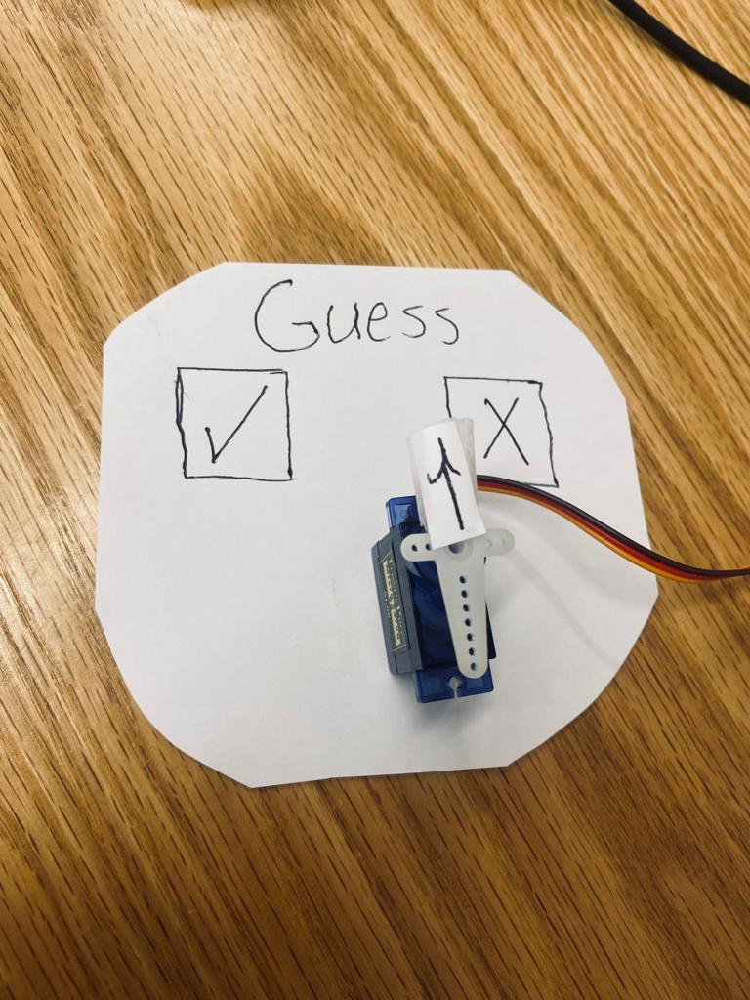
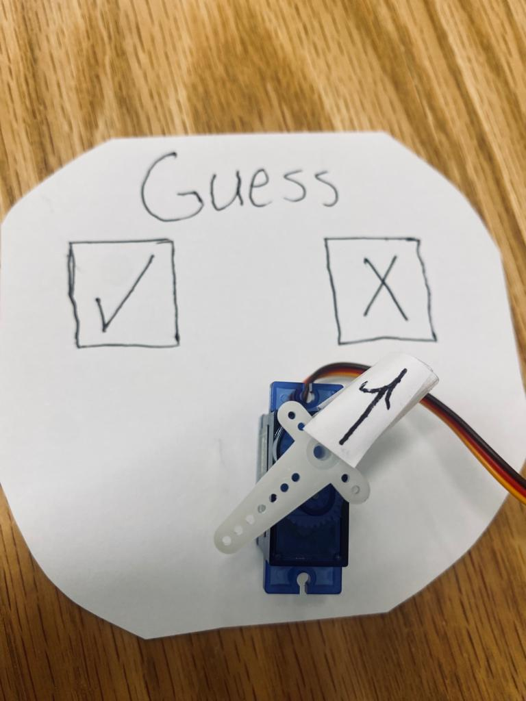
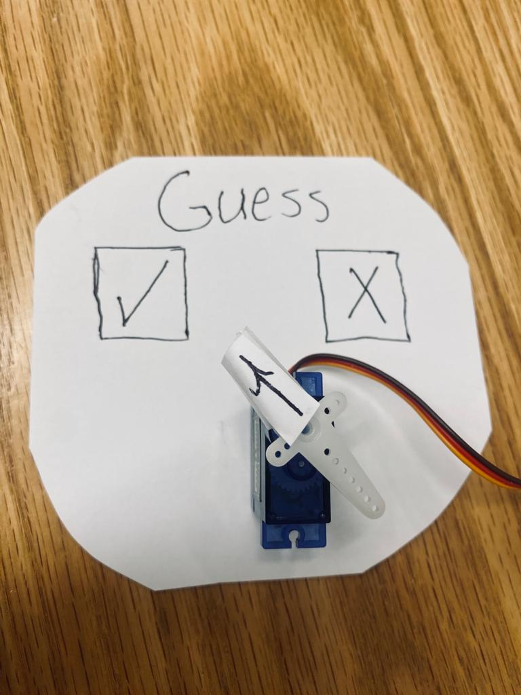

# Guess-The-Word-RPi

<picture>
  
</picture>

### How does it work : 

When you start the game, it will prompt you to choose the category of words you want to play with, such as animals or numbers. After you have made your selection, the game will randomly choose one of the suggested words or numbers from that category. Your task is to guess the chosen word or number. If your answer is correct, the arrow will point to the 'True' signal; otherwise, it will move to the 'False' signal.

<picture>
  
</picture>

<picture>
  
</picture>

### Tools:
* Rasbperry pi
* Servo motor

### How to make/code it :
* The code : 
[click here](test(1).py)
